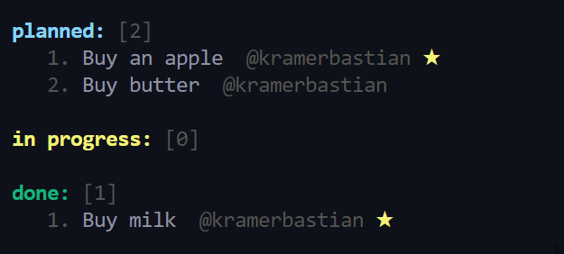

# TasCLI

    

## Description
Tascli is an open-source task-manager like [monday.com](https://www.monday.com), but for command line nerds.

## Features

- Easy syntax
- Self-hosted sync
- Beautiful list

## Install

You have installed [nodejs](https://www.nodejs.org) to run tascli

Using [npm](https://www.npmjs.org) / [yarn](https://yarnpkg.com/):

`npm install -g tascli` or `yarn global add tascli`

Using [snapcraft](https://www.snapcraft.io):

`snap install tascli`
## Documentation

`tascli` - list all tasks

`tascli create <name>` - create a task

`tascli info <name>` - get more info about a task

`tascli remove <name>` - delete a task

`tascli set <name>` - set the status of a task

`tascli init` - create an empty json-file to store your tasks

## 👏 Thanks to
[chalk](https://www.npmjs.com/package/chalk), [jsonfile](https://www.npmjs.com/package/jsonfile), [prompts](https://www.npmjs.com/package/prompts), [removeFromArray](https://www.npmjs.com/package/@amphibian/remove-from-array), [cliui](https://www.npmjs.com/package/cliui), [boxen](https://www.npmjs.com/package/boxen)
